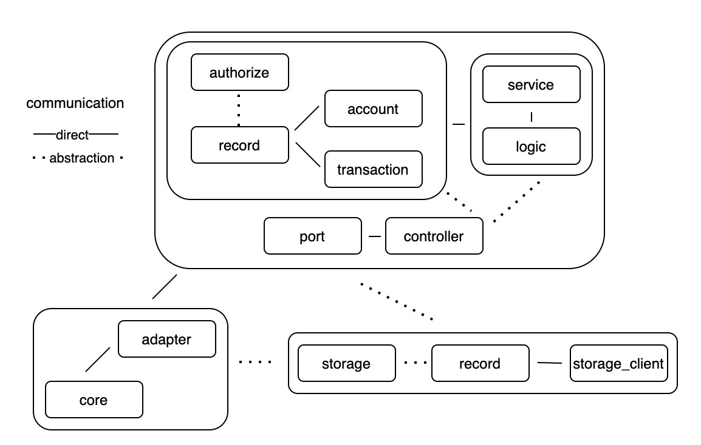

# Authorizer

Provides a solution to enable authorization through account and transactions input.

## Design
- When violation `account-not-initialized` occur the current solution will present the violation along with following default values **available-limit = 0 and active-card = false**
- The solution supposes **more than one** violation may affect a transaction
- Violations are only provided when found some in a processed input; the solution **does not keep** previous violations
- For simplicity’s sake no interface was provided to allow communication between an external layer (adapter) and internal layer (port), so it occurs through direct method call
- The `service` namespace works also as **glue** providing integration between the domain, and the data layer (storage)
- The `storage` is a dependency created at start up and inject to the other layers through function parameters

## Solution
**Clojure** `1.10.1` is the selected programming language. **Leiningen** `2.9.4 on Java 11.0.10 OpenJDK 64-Bit Server VM`

This solution is based on the **adapter and port** pattern which enables to get external data from specialized structures through the adapter layer and then flowing down to the core of the application by a dedicated structure through the port layer.
##### Approach
The solution is organized as follows:



- External layer (infrastructure):
  * core: application start/setup up
  * adapter: get input from stdin and print output, both accordingly to expected data type (json)
  * storage: abstraction to storage data
  * record: implementation of the storage abstraction
  * storage_client: factory for the storage record
- Internal layer (business rules):
  * authorize: abstraction to the domain business rules
  * record: factory to domain models
  * account/transaction: implementation of the domain business rules abstraction
  * service: operations to apply to business rules
  * logic: helper operations when applying business rules
  * port: connection between external and internal layers, converts (to/from) data into valid types accordingly
  * controller: orchestrates applying business rules

## Tests
The solution provides a suite of unit and integration tests.

Many of the unit tests are using `with-redefs` function to allow mocking dependency behaviors. Even for the simplest functions in which there are not too much logic were provided unit tests for code coverage and model validations.

The integration tests are placed in the `integration_test` folder.

To run all available tests just type the following command when inside the root folder of the project:
````
$ lein test
````
To test as a standalone application just type the following command when still inside the root folder of the project:
````
$ lein run < resources/operations
````

## Docker
It is also possible to run the application through Docker. For this just type the following commands when inside the root folder of the project:
````
$ docker build -t authorizer .
$ docker run -i authorizer < resources/operations
````

## External dependencies
The solution uses the following dependencies:
* [clj-time](https://github.com/clj-time/clj-time) `0.15.2` - A date and time library for Clojure, wrapping the [Joda Time](https://www.joda.org/joda-time/) library.
* [cloverage](https://github.com/cloverage/cloverage) `1.2.2` - The cloverage plugin is employed to generate reports about code coverage.
* [data.json](https://github.com/clojure/data.json) `1.0.0` - JSON parser/generator to/from Clojure data structures.
* [quickie](https://github.com/jakepearson/quickie) `0.3.6` - The quickie plugin allows to change/write tests without need calling the tests commands in the terminal.